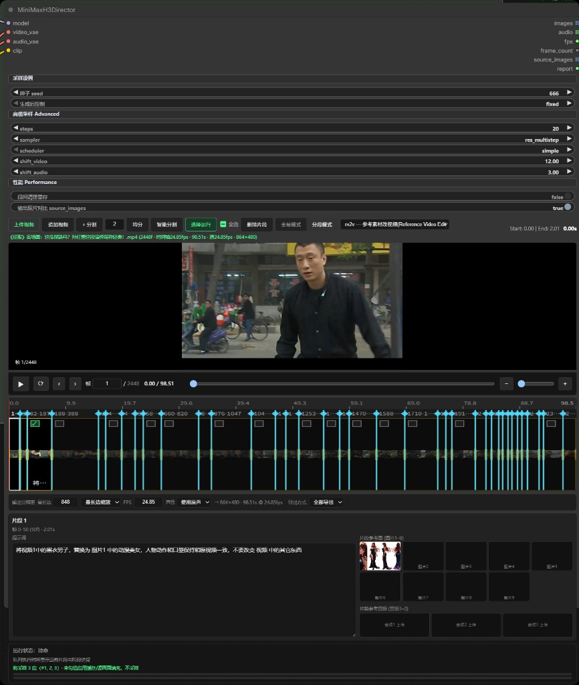

# ComfyUI MiniMax H3 Director

基于 **ComfyUI 官方 MiniMax-H3** 的多段音视频导演台（完整版）。  
在一个节点里完成：分镜计划 → 提示词扩写 → 参考图/首尾帧 → 链式连贯 → 采样出片 → 分段/合并导出。

**当前作者：若扶清**（QQ：3193470083）——在 [AI搅拌手 / AIMixer](https://github.com/AIMixer) 原作基础上参考并继续完善。

仓库：[AIMixer/ComfyUI_MiniMaxH3_Director](https://github.com/AIMixer/ComfyUI_MiniMaxH3_Director)  
**English** → [README_EN.md](README_EN.md)



---

## 这是什么

**MiniMax H3 导演台（完整版）**（节点名 `MiniMaxH3Director`）把官方 MiniMax H3 生成链路，包装成「可编排的导演工作台」：

- 底层走官方 `MiniMaxH3ImageToVideo` / `MiniMaxH3ReferenceToVideo` + `MiniMaxH3SigmaShift` + `KSampler` + AV 分离解码
- 原生输出立体声音频
- 节点内嵌时间轴 + 导演台面板（连续性 / 声景 / 提示词导演 / 参考图导演 / 首尾帧导演）
- 支持本地 GGUF 或云端 API 做分镜与提示词扩写

适合：多镜短片、广告分镜、角色连贯长镜头、源视频分段改写等场景。

---

## 核心能力一览

| 能力 | 说明 |
|------|------|
| **多任务模式** | `t2v` 文生 · `i2v` 图生 · `fl2v` / `fl_chain` 首尾帧 · `r2v` 参考主体 · `v2v` / `rv2v` 源视频改写 |
| **多段时间轴** | 提示词组 / 首尾帧组 / 源视频切分；可视化预览；支持「选择运行」只跑部分组 |
| **导演工作台** | 连续性设定、全局声景、提示词导演、参考图导演、首尾帧导演、分镜导出 |
| **链式连贯** | 上一镜末帧 → 下一镜首帧（`t2v` / `fl2v` / `i2v` / `r2v`；`fl_chain` 常开） |
| **导出方式** | **全部导出**（拼成一条）或 **分段导出**（每组单独输出，接 CreateVideo / SaveVideo 可出多个文件） |
| **原生立体声** | 与画面同次生成；`v2v` / `rv2v` 可选生成 / 原声 / 静音 |
| **运行报告** | `report` 输出分段计划、导出模式、每段摘要 |

### 节点输入 / 输出

**输入：** `model` · `video_vae` · `audio_vae` · `clip`  
（可选参考图生图：`ref_gen_model` / `ref_gen_clip` / `ref_gen_vae`）

**输出：**

| 输出 | 含义 |
|------|------|
| `images` | 画面帧（列表；分段导出时每组一条） |
| `audio` | 音频（与 images 对齐） |
| `fps` / `frame_count` | 帧率 / 总帧数 |
| `source_images` | 源画面（可选） |
| `report` | 运行报告 |
| `ref_image_prompt` | 全局参考图提示词 |
| `shot_image_prompts` | 各组分镜生图提示词 |
| `global_ref_out` | 全局参考图预览 |

> CLIP Loader 的 **type 必须选 `minimax`**（Qwen3-VL）。  
> `t2v` / `i2v` / `fl2v` / `fl_chain` → **fl2va** UNET；`r2v` / `v2v` / `rv2v` → **ref2va** UNET。

---

## 导演工作台（节点内面板）

展开节点下方「导演台」面板，按页签使用：

### ① 连续性
- 填写角色 / 场景 / 道具
- 可勾选「运行时注入到提示词」，采样时自动并入，减少跑偏

### ② 全局声景
- 整体风格、整体声景、非叙事配乐

### ③ 提示词导演
1. 选择本地 GGUF 或云端 API，点「刷新模型」
2. 可选风格 Skill（产品广告 / 3D 动画 / 剪纸定格 / 品牌片 / MV 等）
3. 在「创意简述 / 故事」写剧情
4. 常用按钮（**一钮一事**，不自动连锁）：
   - **故事 → 自动分镜** / **N 组分镜**
   - **故事 → 连续性/声景**
   - **按提示词组扩写**（已完整则跳过）
   - **人物/场景 → 参考图导演**
   - **内容 → 首尾帧导演**（fl2v / fl_chain）
5. 推荐顺序：分镜 →（可选）连续性/声景 →（可选）参考图或首尾帧 → Queue

### ④ 参考图导演（非 fl2v / fl_chain）
1. 启用参考图导演 → ① 生成生图提示词 → ② 生图预览 → ③ 确认注入
2. **本地生图可一键切换**（完整版工作流节点「文生图模型切换」）：
   - **A · SDXL**：`CheckpointLoaderSimple` 完整包
   - **B · Z-Image-Turbo**：UNET + CLIP(`qwen_3_4b`/lumina2) + VAE(`ae`)
   - **C · 自定义**：自行接 FLUX 等三线
3. 未选支路懒加载不占显存；导演台「本地模型族」会随切换同步采样
4. 勿把 MiniMax H3 视频权重接到生图口；本地不可用且已配云端时会自动回退云端 API
3. 生图结果用于时间线 `<Picture N>`，不会误回写「给导演用的全局参考底图」槽

### ⑤ 首尾帧导演（fl2v / fl_chain）
1. 「添加一组」：首帧必传，尾帧可选
2. 可用「内容 → 首尾帧导演」生成首/尾帧文生图提示词并出图导入
3. 各组提示词写中间运动过程

### 链式连贯
输出栏勾选 **链式连贯**（或使用 `fl_chain` 任务）：
- 上一分镜末帧自动作为下一分镜首帧
- `t2v`：第 1 组纯文生，从第 2 组起锁首帧
- 请按顺序运行，勿跳过中间镜

### 导出方式
- **全部导出**：多段拼成一条长视频
- **分段导出**：每组单独一条；下游 `CreateVideo` → `SaveVideo` 会按列表各存一个文件

---

## 任务与模型速查

| 任务 | UNET | 要点 |
|------|------|------|
| `t2v` | fl2va | 文生视频；可开链式连贯 / 分段导出 |
| `i2v` | fl2va / 按工作流 | 图生视频；可开链式连贯 |
| `fl2v` | fl2va | 多组首尾帧；可开链式连贯 |
| `fl_chain` | fl2va | fl2v + 链式连贯常开 |
| `r2v` | ref2va | 素材组（图/音/视频）；可开链式连贯 |
| `v2v` | ref2va | 上传源视频，分段改写 |
| `rv2v` | ref2va | 源视频 + 参考图/音频 |

---

## 环境要求

- **ComfyUI ≥ v0.30.0**（含官方 MiniMax H3 节点：[PR #15224](https://github.com/comfyanonymous/ComfyUI/pull/15224)、[PR #15228](https://github.com/comfyanonymous/ComfyUI/pull/15228)）
- 可选依赖见 `requirements.txt`（如 `scenedetect`、`opencv-python-headless`、`imageio-ffmpeg`）

---

## 安装

### 方法一：Git Clone

```bash
cd ComfyUI/custom_nodes
git clone https://github.com/AIMixer/ComfyUI_MiniMaxH3_Director.git
pip install -r ComfyUI_MiniMaxH3_Director/requirements.txt
```

重启 ComfyUI。

### 方法二：ComfyUI Manager

1. 打开 **ComfyUI Manager**
2. **Install via Git URL**
3. 填入 `https://github.com/AIMixer/ComfyUI_MiniMaxH3_Director.git`
4. 重启 ComfyUI

---

## 模型与示例工作流

完整资源包（**权重 + JSON 工作流**）：  
**[Comfyit 搅拌站 · 文章 506](https://comfyit.cn/article/506)**

也可：

- [Hugging Face · Comfy-Org/MiniMax-H3](https://huggingface.co/Comfy-Org/MiniMax-H3)
- [ComfyUI 文档 · MiniMax H3](https://docs.comfy.org/zh/tutorials/video/minimax/minimax-h3)

### 推荐模型文件

| 用途 | 文件 | 目录 |
|------|------|------|
| UNET（t2v / i2v / fl2v） | `minimax_h3_fl2va_pruned_int8_convrot.safetensors` | `models/diffusion_models/` |
| UNET（r2v / v2v / rv2v） | `minimax_h3_ref2va_pruned_int8_convrot.safetensors` | `models/diffusion_models/` |
| CLIP | `qwen3vl_32b_minimax_h3_nvfp4_awq.safetensors` | `models/text_encoders/` |
| Video VAE | `minimax_h3_video_vae_fp16.safetensors` | `models/vae/` |
| Audio VAE | `minimax_h3_audio_vae_fp32.safetensors` | `models/vae/` |

### 本仓库示例（`example_workflows/`）

| 工作流 | 说明 |
|--------|------|
| `完整版_MiniMaxH3导演台.json` | **唯一**示例工作流：导演台 + 文生图 + 导出；任务模式在节点内切换 |

完整版工作流文生图口 **只固定接 DreamShaperXL_Turbo**（节点「文生图 · DreamShaperXL（唯一）」直连 `ref_gen_*`；下拉已隐藏 ltx 等视频文件）。请重新加载最新 JSON，勿沿用画布里旧的 CheckpointLoader。

---

## 快速开始

1. 确认 ComfyUI ≥ **0.30.0**，能加载官方 MiniMax H3 节点  
2. 加载 `example_workflows/完整版_MiniMaxH3导演台.json`  
3. 接好 UNET / CLIP / Video VAE / Audio VAE  
4. 在导演台内：选任务 → 写故事分镜（或手写各组提示词）→ 调时长 → Queue  
5. 看 `report` 确认导出模式与段数；分段导出时检查 `output` 是否多文件  

**默认采样：** 画布约 **864×480**，**124 帧 / 5s @ 24fps**，25 steps，`res_multistep` + `simple`，CFG 1.0；Sigma shift video **12** / audio **3**。

**视频教程：** [B 站合集 · 插件使用教程](https://space.bilibili.com/1997403556/lists/8357740)

更细的面板说明见仓库内 [`完整版使用说明.txt`](完整版使用说明.txt)。

---

## 推荐出片流程（摘要）

```text
选任务与模型
  → 连续性（角色/场景/道具）
  → 全局声景（可选）
  → 提示词导演：故事 → 分镜
  → 参考图导演 / 首尾帧导演（按需）
  → 勾选链式连贯（按需）
  → 选择 全部导出 / 分段导出
  → Queue
```

---

## 配套生态

| 栏目 | 链接 |
|------|------|
| 模型 / 工作流包 | [comfyit.cn/article/506](https://comfyit.cn/article/506) |
| 官方 MiniMax H3 文档 | [docs.comfy.org](https://docs.comfy.org/zh/tutorials/video/minimax/minimax-h3) |
| 插件视频教程 | [B 站合集](https://space.bilibili.com/1997403556/lists/8357740) |
| Comfyit 搅拌站 | [comfyit.cn](https://comfyit.cn/) |

---

## 作者与交流

| | |
|---|---|
| **当前作者 / 维护者** | **若扶清** |
| **作者 QQ** | **3193470083** |
| **本仓库** | [ComfyUI_MiniMaxH3_Director](https://github.com/AIMixer/ComfyUI_MiniMaxH3_Director) |

本仓库在 [AI搅拌手 / AIMixer](https://github.com/AIMixer) 原有 MiniMax H3 导演台实现与文档思路上参考、整理并继续完善；感谢原作者的开源贡献。  
原作者相关：QQ `3697688140` · 交流群 `551482703` / `425064221` / `559826331` · [B 站](https://space.bilibili.com/1997403556) · 姊妹插件 [ComfyUI_Bernini_Director](https://github.com/AIMixer/ComfyUI_Bernini_Director)

---

## 致谢

- **AI搅拌手 / AIMixer** — 本插件的原始作者与前期实现参考  
- [Comfy-Org / ComfyUI](https://github.com/Comfy-Org/ComfyUI) — 官方 MiniMax H3 支持  
- [MiniMax-AI](https://github.com/MiniMax-AI) — MiniMax H3 模型  
- [Comfy-Org/MiniMax-H3](https://huggingface.co/Comfy-Org/MiniMax-H3) — 权重与文档  
- 提示词规范对齐官方 [h3-prompt-writing](https://github.com/MiniMax-AI/MiniMax-H3/tree/main/skills/h3-prompt-writing)

## 许可证

[Apache-2.0](LICENSE)
