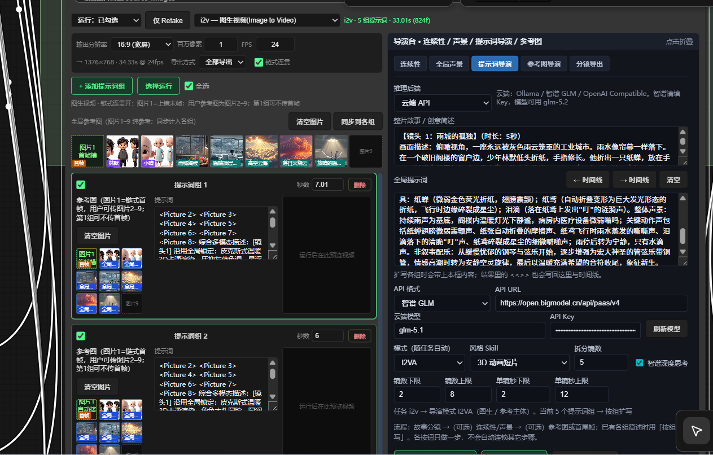

# ComfyUI MiniMax H3 Director

A multi-segment audio/video director console (full version) built on the **official ComfyUI MiniMax-H3**.

Everything happens inside a single node: storyboard planning → prompt expansion → reference images / first & last frames → chain continuity → sampling → segment/merge export.

**Current author: 若扶清** (QQ: 3193470083) — continued and improved based on the original work of [AI搅拌手 / AIMixer](https://github.com/AIMixer).

Repo: [AIMixer/ComfyUI_MiniMaxH3_Director](https://github.com/AIMixer/ComfyUI_MiniMaxH3_Director)

**中文** → [README.md](README.md)



---

## What is this

**MiniMax H3 Director (Full Version)** (node name `MiniMaxH3Director`) wraps the official MiniMax H3 generation pipeline into an **orchestratable director console**:

- Under the hood it uses the official `MiniMaxH3ImageToVideo` / `MiniMaxH3ReferenceToVideo` + `MiniMaxH3SigmaShift` + `KSampler` + audio/video split decoding
- Natively outputs stereo audio
- Built-in timeline + director panels inside the node (continuity / soundscape / prompt director / reference-image director / first-and-last-frame director)
- Supports local GGUF or cloud API for storyboarding and prompt expansion

Great for: multi-shot short films, ad storyboards, character-consistent long takes, source-video segment rewriting, and similar scenarios.

---

## Key features at a glance

| Feature | Description |
|---------|-------------|
| **Multi-task modes** | `t2v` text-to-video · `i2v` image-to-video · `fl2v` / `fl_chain` first & last frame · `r2v` reference subject · `v2v` / `rv2v` source-video rewriting |
| **Multi-segment timeline** | prompt groups / first & last frame groups / source-video cuts; visual preview; supports "run selected" to run only some groups |
| **Director console** | continuity settings, global soundscape, prompt director, reference-image director, first/last-frame director, storyboard export |
| **Chain continuity** | last frame of previous shot → first frame of next shot (`t2v` / `fl2v` / `i2v` / `r2v`; `fl_chain` always on) |
| **Export modes** | **Export all** (stitched into one) or **Export segments** (each group output separately; chain with CreateVideo / SaveVideo to save multiple files) |
| **Native stereo audio** | generated together with the visuals; `v2v` / `rv2v` can generate / keep original / mute |
| **Run report** | `report` outputs the segment plan, export mode, and a summary of each segment |

### Node inputs / outputs

**Inputs:** `model` · `video_vae` · `audio_vae` · `clip`
(optional reference-image generation: `ref_gen_model` / `ref_gen_clip` / `ref_gen_vae`)

**Outputs:**

| Output | Meaning |
|--------|---------|
| `images` | Video frames (list; one entry per group in segment export) |
| `audio` | Audio (aligned with `images`) |
| `fps` / `frame_count` | Frame rate / total frame count |
| `source_images` | Source frames (optional) |
| `report` | Run report |
| `ref_image_prompt` | Global reference-image prompt |
| `shot_image_prompts` | Per-group storyboard image prompts |
| `global_ref_out` | Global reference-image preview |

> The CLIP Loader **type must be set to `minimax`** (Qwen3-VL).
> `t2v` / `i2v` / `fl2v` / `fl_chain` → **fl2va** UNET; `r2v` / `v2v` / `rv2v` → **ref2va** UNET.

---

## Director console (in-node panel)

Expand the "Director" panel below the node and use it by tab:

### ① Continuity
- Fill in characters / scenes / props
- Optionally check "inject into prompt at runtime"; it is merged in automatically during sampling to reduce drift

### ② Global soundscape
- Overall style, overall soundscape, non-narrative music

### ③ Prompt director
1. Choose local GGUF or cloud API, click "refresh models"
2. Optional style Skills (product ad / 3D animation / paper-cut stop-motion / brand film / MV, etc.)
3. Write the story in "creative brief / story"
4. Common buttons (**one button, one action** — no automatic chaining):
   - **Story → auto storyboard** / **N-segment storyboard**
   - **Story → continuity/soundscape**
   - **Expand by prompt group** (skipped if already complete)
   - **Characters/scenes → reference-image director**
   - **Content → first/last-frame director** (fl2v / fl_chain)
5. Recommended order: storyboard → (optional) continuity/soundscape → (optional) reference images or first/last frames → Queue

### ④ Reference-image director (non-fl2v / fl_chain)
1. Enable reference-image director → ① generate image prompt → ② preview image → ③ confirm injection
2. Local image generation requires an SD/SDXL Checkpoint (not H3)
3. The generated images feed the timeline `<Picture N>`; they will not accidentally overwrite the "global reference base image for the director" slot

### ⑤ First/last-frame director (fl2v / fl_chain)
1. "Add a group": the first frame is required, the last frame is optional
2. Use "content → first/last-frame director" to generate first/last frame text-to-image prompts and import the images
3. Write the intermediate motion in each group's prompt

### Chain continuity
Check **chain continuity** in the output section (or use the `fl_chain` task):
- The last frame of the previous shot automatically becomes the first frame of the next shot
- `t2v`: group 1 is pure text-to-video; from group 2 onward the first frame is locked
- Run in order — do not skip intermediate shots

### Export mode
- **Export all**: stitches multiple segments into one long video
- **Export segments**: each group is its own clip; downstream `CreateVideo` → `SaveVideo` saves one file per list entry

---

## Task & model quick reference

| Task | UNET | Notes |
|------|------|-------|
| `t2v` | fl2va | Text-to-video; supports chain continuity / segment export |
| `i2v` | fl2va / per workflow | Image-to-video; supports chain continuity |
| `fl2v` | fl2va | Multiple first/last-frame groups; supports chain continuity |
| `fl_chain` | fl2va | fl2v + chain continuity always on |
| `r2v` | ref2va | Asset groups (images/audio/video); supports chain continuity |
| `v2v` | ref2va | Upload a source video and rewrite it segment by segment |
| `rv2v` | ref2va | Source video + reference images/audio |

---

## Environment requirements

- **ComfyUI ≥ v0.30.0** (includes official MiniMax H3 nodes: [PR #15224](https://github.com/comfyanonymous/ComfyUI/pull/15224), [PR #15228](https://github.com/comfyanonymous/ComfyUI/pull/15228))
- Optional dependencies are listed in `requirements.txt` (e.g. `scenedetect`, `opencv-python-headless`, `imageio-ffmpeg`)

---

## Installation

### Method 1: Git clone

```bash
cd ComfyUI/custom_nodes
git clone https://github.com/awangjunjie/comfyui_Automated-All-in-One-Director.git
pip install -r comfyui_Automated-All-in-One-Director/requirements.txt
```

Restart ComfyUI.

### Method 2: ComfyUI Manager

1. Open **ComfyUI Manager**
2. **Install via Git URL**
3. Enter `https://github.com/awangjunjie/comfyui_Automated-All-in-One-Director.git`
4. Restart ComfyUI

---

## Models & example workflows

Full resource pack (**weights + JSON workflows**):
**[Comfyit 搅拌站 · Article 506](https://comfyit.cn/article/506)**

Also:

- [Hugging Face · Comfy-Org/MiniMax-H3](https://huggingface.co/Comfy-Org/MiniMax-H3)
- [ComfyUI Docs · MiniMax H3](https://docs.comfy.org/zh/tutorials/video/minimax/minimax-h3)

### Recommended model files

| Purpose | File | Folder |
|---------|------|--------|
| UNET (t2v / i2v / fl2v) | `minimax_h3_fl2va_pruned_int8_convrot.safetensors` | `models/diffusion_models/` |
| UNET (r2v / v2v / rv2v) | `minimax_h3_ref2va_pruned_int8_convrot.safetensors` | `models/diffusion_models/` |
| CLIP | `qwen3vl_32b_minimax_h3_nvfp4_awq.safetensors` | `models/text_encoders/` |
| Video VAE | `minimax_h3_video_vae_fp16.safetensors` | `models/vae/` |
| Audio VAE | `minimax_h3_audio_vae_fp32.safetensors` | `models/vae/` |

### Example workflows in this repo (`example_workflows/`)

| Workflow | Description |
|----------|-------------|
| `完整版_MiniMaxH3导演台.json` | Full version master workflow |
| `完整版_MiniMaxH3导演台_文生视频_t2v.json` | t2v |
| `完整版_MiniMaxH3导演台_首尾帧_fl2v.json` | fl2v |
| `完整版_MiniMaxH3导演台_参考主体_r2v.json` | r2v |
| `完整版_MiniMaxH3导演台_视频改视频_v2v.json` | v2v |
| `完整版_MiniMaxH3导演台_参考改视频_rv2v.json` | rv2v |
| `minimax_h3_director_*.json` | Simplified examples (same modes as above) |

---

## Quick start

1. Make sure ComfyUI ≥ **0.30.0** and can load the official MiniMax H3 nodes
2. Load any full-version JSON from `example_workflows/`
3. Connect UNET / CLIP / Video VAE / Audio VAE
4. In the director console: pick a task → write the story / storyboard (or hand-write each group's prompt) → adjust duration → Queue
5. Check `report` to confirm the export mode and segment count; with segment export, check `output` for multiple files

**Default sampling:** canvas about **864×480**, **124 frames / 5s @ 24fps**, 25 steps, `res_multistep` + `simple`, CFG 1.0; Sigma shift video **12** / audio **3**.

**Video tutorial:** [Bilibili playlist · plugin tutorial](https://space.bilibili.com/1997403556/lists/8357740)

For more detailed panel instructions, see [`完整版使用说明.txt`](完整版使用说明.txt) in this repo.

---

## Recommended pipeline (summary)

```text
Choose task & model
  → Continuity (characters/scenes/props)
  → Global soundscape (optional)
  → Prompt director: story → storyboard
  → Reference-image director / first & last frame director (as needed)
  → Check chain continuity (as needed)
  → Choose Export all / Export segments
  → Queue
```

---

## Ecosystem

| Item | Link |
|------|------|
| Model / workflow pack | [comfyit.cn/article/506](https://comfyit.cn/article/506) |
| Official MiniMax H3 docs | [docs.comfy.org](https://docs.comfy.org/zh/tutorials/video/minimax/minimax-h3) |
| Plugin video tutorial | [Bilibili playlist](https://space.bilibili.com/1997403556/lists/8357740) |
| Comfyit 搅拌站 | [comfyit.cn](https://comfyit.cn/) |

---

## Author & contact

| | |
|---|---|
| **Current author / maintainer** | **若扶清** |
| **Author QQ** | **3193470083** |
| **This repo** | [comfyui_Automated-All-in-One-Director](https://github.com/awangjunjie/comfyui_Automated-All-in-One-Director) |

This repo references, organizes, and continues improving upon the original MiniMax H3 Director implementation and documentation of [AI搅拌手 / AIMixer](https://github.com/AIMixer); thanks to the original author for their open-source contribution.
Original author: QQ `3697688140` · community groups `551482703` / `425064221` / `559826331` · [Bilibili](https://space.bilibili.com/1997403556) · sister plugin [ComfyUI_Bernini_Director](https://github.com/AIMixer/ComfyUI_Bernini_Director)

---

## Acknowledgements

- **AI搅拌手 / AIMixer** — original author and early implementation reference for this plugin
- [Comfy-Org / ComfyUI](https://github.com/Comfy-Org/ComfyUI) — official MiniMax H3 support
- [MiniMax-AI](https://github.com/MiniMax-AI) — MiniMax H3 model
- [Comfy-Org/MiniMax-H3](https://huggingface.co/Comfy-Org/MiniMax-H3) — weights and documentation
- Prompt conventions aligned with the official [h3-prompt-writing](https://github.com/MiniMax-AI/MiniMax-H3/tree/main/skills/h3-prompt-writing)
